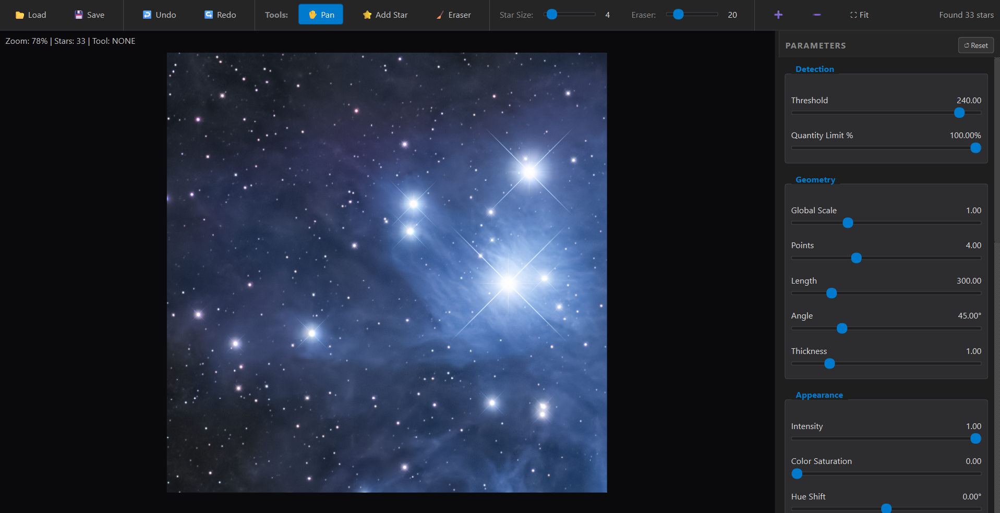

# AstroSpike – Python Application



**AstroSpike** is a cross‑platform desktop application written in Python (PyQt6) that adds realistic diffraction spikes, halos, and rainbow effects to astrophotography images. It mirrors the functionality of the original React/Electron version, providing a native UI and high‑performance rendering using Qt's painting system.

---

## 📦 Prerequisites

- **Python 3.10+** (tested on 3.12)
- **PyQt6** – GUI framework
- **NumPy** – numerical operations
- **Pillow** – image loading and saving

You can install all required packages via:
```bash
pip install -r requirements.txt
```
The `requirements.txt` file contains:
```
PyQt6
numpy
pillow
```

---

## 🚀 Running the Application

From the project root (`SpikePython` folder), execute:
```bash
python main.py
```
The main window will appear, allowing you to load an image, detect stars, adjust parameters, and export the processed image.

---

## 📚 Features

| Feature | Description |
|--------|-------------|
| **Image Import** | Load any JPEG/PNG image via the **Load** button. |
| **Star Detection** | Uses a background `QThread` to analyse the image and extract bright points based on a configurable threshold. |
| **Spike Rendering** | Adjustable spike length, quantity, width, intensity, angle, and secondary spikes. |
| **Rainbow Overlay** | Optional rainbow diffraction spikes drawn as an overlay on top of the standard spikes. |
| **Halo & Glow** | Soft halo and glow effects with configurable saturation, blur, and scale. |
| **Zoom & Fit** | Buttons for zoom‑in, zoom‑out, and **Fit to Screen** that centre and scale the image. |
| **Undo / Redo** | History stack for star modifications (currently placeholders). |
| **Brush Tools** | **Mask** (add stars) and **Eraser** tools with adjustable radii. |
| **Reset** | Restores default configuration values. |
| **Export** | Save the final composited image as PNG or JPG. |

---

## 🧩 Technical Details & Algorithms

### 1. Star Detection (Background Thread)
- The `StarDetectionThread` runs in a separate `QThread` to keep the UI responsive.
- It converts the image to a NumPy array, computes luminance, and selects pixels above a **threshold**.
- A simple clustering algorithm groups nearby bright pixels into a single `Star` object (`x`, `y`, `radius`, `brightness`, `color`).
- Results are emitted via a Qt signal and consumed by the main UI.

### 2. Rendering Pipeline (Qt Painter)
- The `Renderer` class handles all drawing operations using `QPainter`.
- **Standard Spikes**: For each star, a linear gradient (`QLinearGradient`) is created from the star centre to the spike tip. The gradient fades from the base color to transparent, with optional sharpness control.
- **Rainbow Overlay**: When the rainbow flag is enabled, a second gradient (`r_grad`) is drawn on top, using `QColor.fromHslF` to generate hue‑rotated colors. The overlay is drawn after the standard spikes, and the standard spikes are dimmed (`globalAlpha = 0.4`) to keep the rainbow visible.
- **Halo**: Implemented with a radial gradient (`QRadialGradient`) that expands outward, using configurable blur and width.
- All drawing respects the current `viewState` (`scale`, `x`, `y`) for pan/zoom.

### 3. Rainbow Overlay Logic
- The rainbow spikes are rendered **after** the normal spikes, using a separate gradient with higher opacity (clamped to 1.0). When active, the standard spikes are drawn with reduced opacity (`painter.setOpacity(0.4)`) so the rainbow effect stands out.

### 4. State Management
- The main window (`MainWindow`) holds a `SpikeConfig` dataclass containing all user‑adjustable parameters.
- UI controls (`ControlPanel`) emit `config_changed` signals that update the configuration and trigger a re‑render.
- History for undo/redo is stored as a list of star arrays, with an index pointer.

---

## 🛠️ Stack Overview
- **Python 3.10+** – core language
- **PyQt6** – GUI and rendering
- **NumPy** – fast numeric processing for star detection
- **Pillow** – image I/O and saving
- **Qt Threading** – background processing for detection

---

## 📜 License

This project is released under the **MIT License**. You are free to use, modify, and distribute the software, provided the original copyright notice is retained.

---

## 🙋‍♀️ Contributing

Contributions are welcome! Feel free to open issues or submit pull requests. Please follow PEP‑8 style guidelines and include unit tests for new functionality.

---

## 📞 Support

If you encounter any problems, open an issue on the repository or contact the maintainer at `fabio@example.com`.
